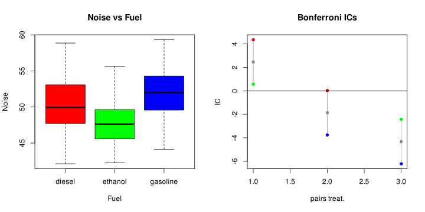

# Problem 1: Noise pollution due to cars
## Question a)
First check the assumptions of the ANOVA model:
- Normality of the groups:
```R
> Ps <- c(
    shapiro.test(noise[fuel == "diesel" & category == "commercial"])$p.value,
    shapiro.test(noise[fuel == "diesel" & category == "passenger"])$p.value,
    shapiro.test(noise[fuel == "ethanol" & category == "commercial"])$p.value,
    shapiro.test(noise[fuel == "ethanol" & category == "passenger"])$p.value,
    shapiro.test(noise[fuel == "gasoline" & category == "commercial"])$p.value,
    shapiro.test(noise[fuel == "gasoline" & category == "passenger"])$p.value
)
Ps
> Ps
0.3574334 0.2930456 0.5325407 0.7372111 0.1878295 0.7897125
```
All p-values are greater than 0.1, so we can't reject at any significant level the normality of the groups.

- Homoscedasticity:
```R
> bartlett.test(noise ~ fuel_category)

        Bartlett test of homogeneity of variances

data:  noise by fuel_category
Bartlett's K-squared = 7.968, df = 5, p-value = 0.158
```
The p-value is greater than 0.1, so we can't reject at any significant level the homoscedasticity of the groups.

Now that I have checked the assumptions, I can perform the ANOVA test:

### Complete ANOVA model with interactions:
$$ X_{ijk} = mu + tau_i + beta_j + gamma_{ij} + \epsilon_{ijk} $$
with:
- $mu$: overall mean
- $tau_i$: effect of fuel $i$
- $beta_j$: effect of category $j$
- $gamma_{ij}$: interaction effect of fuel $i$ and category $j$
- $\epsilon_{ijk} \sim \mathcal{N}(0, \sigma^2)$: error term
```R
> summary(aov(noise ~ fuel + category + fuel:category))
               Df Sum Sq Mean Sq F value   Pr(>F)    
fuel            2  375.8  187.91  16.040 7.28e-07 ***
category        1   21.8   21.84   1.864   0.1749    
fuel:category   2   63.8   31.91   2.723   0.0699 .  
Residuals     114 1335.5   11.72                     
```
From the summary I can see that:
- Test 1: 

    $ H0: \gamma_i = 0, i = 1,...,6 $ vs $H1: (H0)^c $

    that is:
    - H0: the effect of the fuel doesn't significantly affect the noise pollution 
    - H1: the effect of the fuel significantly affects the noise pollution
    
    -> the p-value for this test is 0.0699: I reject at 10% the null hypothesis but not at 5% and 1%. 
       
    -> we don't have strong evidence that the interaction term has effect
- Test 2: 
    $H0: tau_i = 0, i = 1,2,3$ vs $H1: (H0)^c$

    that is
    - H0: the effect of the fuel doesn't significantly affect the noise pollution
    - H1: the effect of the fuel significantly affects the noise pollution
    
    -> the p-value for this test is ~ 7e-07: I reject at 1% the null hypothesis so I can conclude that the effect of the fuel significantly affects the noise pollution
- Test 3: 
    $ H0: beta_i = 0, i = 1,2$ vs $H1: (H0)^c$

    that is
    - H0: the effect of the category doesn't significantly affect the noise pollution
    - H1: the effect of the category significantly affects the noise pollution
    
    -> the p-value for this test is ~ 0.1749: I reject at any significant level the null hypothesis so I can conclude that the effect of the category doesn't significantly affect the noise pollution

## Question b)
Test 1 -> we don't have strong evidence that the interaction term has effect
-> remove the interaction term and estimate an additive model

Model without interactions (additive model):
$$X_{ijk} = mu + tau_i + beta_j + \epsilon_{ijk}$$
with $\epsilon_{ijk} \sim \mathcal{N}(0, \sigma^2)$
     $i = 1,...,g, j = 1,...,b, k = 1,...,n$

```R
> summary(aov(noise ~ fuel + category))
             Df Sum Sq Mean Sq F value   Pr(>F)    
fuel          2  375.8  187.91   15.58 1.02e-06 ***
category      1   21.8   21.84    1.81    0.181    
Residuals   116 1399.3   12.06                     
---
Signif. codes:  0 ‘***’ 0.001 ‘**’ 0.01 ‘*’ 0.05 ‘.’ 0.1 ‘ ’ 1
```

From the summary I can see that:
- Test 1: H0: $tau_i = 0, i = 1,2,3$ vs $H1: (H0)^c$

    that is
    - H0: the effect of the fuel doesn't significantly affect the noise pollution
    - H1: the effect of the fuel significantly affects the noise pollution
    -> the p-value for this test is ~ 1e-06: I reject at any significant level the null hypothesis so I can conclude that the effect of the fuel significantly affects the noise pollution
- Test 2: $H0: beta_i = 0, i = 1,2$ vs $H1: (H0)^c$
    
    that is
    - H0: the effect of the category doesn't significantly affect the noise pollution
    - H1: the effect of the category significantly affects the noise pollution
    -> the p-value for this test is ~ 0.181: can't reject the null hypothesis, so I can't conclude that the effect of the category significantly affects the noise pollution

I can remove also the category term and estimate a model with only the fuel term

--> One-way ANOVA model:
First I check again the assumptions:
```R
> Ps.fuel <- c(
   shapiro.test(noise[fuel == "gasoline"])$p.value,
   shapiro.test(noise[fuel == "diesel"])$p.value,
   shapiro.test(noise[fuel == "ethanol"])$p.value
)
> Ps.fuel
0.4181352 0.9144642 0.7071619
```
```R
> bartlett.test(noise ~ fuel)

        Bartlett test of homogeneity of variances

data:  noise by fuel
Bartlett's K-squared = 5.0213, df = 2, p-value = 0.08121
```

I can't reject at any significant level the normality, I can reject the homoscedasticity of the groups at 10% but not at 5% and 1%.

Model with only the fuel term:
$$X_{ijk} = mu + tau_i + epsilon_{ik}$$
with $\epsilon_{ik} \sim \mathcal{N}(0, \sigma^2)$
     $i = 1,...,g, k = 1,...,n$

```R
> summary(aov(noise ~ fuel))
             Df Sum Sq Mean Sq F value   Pr(>F)    
fuel          2  375.8  187.91   15.47 1.09e-06 ***
Residuals   117 1421.2   12.15                     
---
Signif. codes:  0 ‘***’ 0.001 ‘**’ 0.01 ‘*’ 0.05 ‘.’ 0.1 ‘ ’ 1
```

## Question c)

Estimates of the parameters:
- Variance
```R
# Sum of squares of the residuals
> SS.res <- sum((aov.fuel$residuals)^2)
# or sum i = 1 to g, j = 1 to n.g (X_ij - M_i)^2
> sum((noise - M.fuel[fuel])^2)
1421.181
> SS.res
1421.181
# DoF of the residuals
> df.res <- N - g
> df.res # RMK: this is the same as aov.fuel$df.residual
117
S <- SS.res / df.res
S
> 12.14685
# This is the estimate of the variance
```

- Means
```R
# overall mean
> M
49.98414
# estimates of tau_i, i = 1,2,3 (diesel, ethanol, gasoline)
> tapply(aov.fuel$fitted.values - mean(noise), fuel, mean)
    diesel    ethanol   gasoline 
 0.1964631 -2.2589768  2.0625137
# Mean of the three groups (diesel, ethanol, gasoline)
> M.fuel
  diesel  ethanol gasoline 
50.18060 47.72516 52.04665
```

## Question d)
```R
# Bonferroni intervals 95% for the differences of the means
> alpha <- 0.05
# number of comparisons:
> k <- g * (g - 1) / 2 # k = 3
# T-student quantile
> qT <- qt(1 - alpha / (2 * k), N - g)
> lower.diesel_ethanol <- M.fuel[1] - M.fuel[2] - qT * sqrt(S * 2 / n.g)
> upper.diesel_ethanol <- M.fuel[1] - M.fuel[2] + qT * sqrt(S * 2 / n.g)
> lower.diesel_gasoline <- M.fuel[1] - M.fuel[3] - qT * sqrt(S * 2 / n.g)
> upper.diesel_gasoline <- M.fuel[1] - M.fuel[3] + qT * sqrt(S * 2 / n.g)
> lower.ethanol_gasoline <- M.fuel[2] - M.fuel[3] - qT * sqrt(S * 2 / n.g)
> upper.ethanol_gasoline <- M.fuel[2] - M.fuel[3] + qT * sqrt(S * 2 / n.g)

> IC.range <- rbind(
   as.numeric(c(lower.diesel_ethanol, upper.diesel_ethanol)),
   as.numeric(c(lower.diesel_gasoline, upper.diesel_gasoline)),
   as.numeric(c(lower.ethanol_gasoline, upper.ethanol_gasoline))
)
> dimnames(IC.range) <- list(c("diesel-ethanol", "diesel-gasoline", "ethanol-gasoline"), c("lower", "upper"))

> IC.range
                      lower       upper
diesel-ethanol    0.5625541  4.34832575
diesel-gasoline  -3.7589364  0.02683522
ethanol-gasoline -6.2143764 -2.42860470
```

There is statistical evidence that the fuel alone has effect on the noise pollution, since not all the intervals contain 0.

As we can see only the diesel-gasoline pair has an IC that contains 0, so we can't conclude that the difference between the means of the two groups is significant.

The other two pairs have ICs that don't contain 0, so we can conclude that the difference between the means of the two groups is significant.





