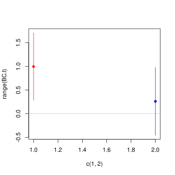

<!-- <script type="text/javascript" src="http://cdn.mathjax.org/mathjax/latest/MathJax.js?config=TeX-AMS-MML_HTMLorMML"></script>
<script type="text/x-mathjax-config">
  MathJax.Hub.Config({ tex2jax: {inlineMath: [['$', '$']]}, messageStyle: "none" });
</script> -->

# Problem 1: Best Pulpo a la Gallega
## Question a)
Let's first check for the multivariate normality of the data (even though in the text there's written that we can assume it as Gaussian).

```R
> mvn(city1)$multivariateNormality$`p value`
0.151378
> mvn(city2)$multivariateNormality$`p value`
0.2651369
```

For both the p-value is greater that any significan level, so we can assume that the data is Gaussian.

Now let's compute the means of the two populations, as well as the covariance matrices.

```R
> city1.mean <- colMeans(city1)
> city1.mean
      T1       T2 
8.279667 7.710667
> city2.mean <- colMeans(city2)
> city2.mean
   T1    T2 
7.284 7.451
```

```R
> city1.cov <- cov(city1)
> city1.cov
          T1        T2
T1 0.8595068 0.6756002
T2 0.6756002 0.9691168
> city2.cov <- cov(city2)
> city2.cov
          T1        T2
T1 1.2950041 0.7739269
T2 0.7739269 1.1957817
```

The main assumption needed in order to test for the comparison of the means of two populations is that the two populations have the same covariance matrix. In this case, they're not excactly the same, but we can assume they're equality and use the Spooled covariance matrix to perform the test.

```R
# Spooled covariance
> Spooled <- ((n1 - 1) * city1.cov + (n2 - 1) * city2.cov) / (n1 + n2 - 2)
> Spooled
          T1        T2
T1 1.0772555 0.7247636
T2 0.7247636 1.0824493
```

I can now compute the test 
$$ H0: \vec{\mu_1} = \vec{\mu_2} \text{ vs } H1: \vec{\mu_1} \neq \vec{\mu_2}$$
i.e.
$$ H0: \vec{\mu_1} - \vec{\mu_2} = \vec{0} \text{ vs } H1: \vec{\mu_1} - \vec{\mu_2} \neq \vec{0}$$

by using Hotelling's theorem.

```R
> alpha <- 0.01
> diff <- c(0, 0)
> Spooled.inv <- solve(Spooled)

> T2 <- n1 * n2 / (n1 + n2) * (city1.mean - city2.mean - diff) %*% Spooled.inv %*% (city1.mean - city2.mean - diff)
> F.test <- (p * (n1 + n2 - 2) / (n1 + n2 - p - 1)) * qf(1 - alpha, p, n1 + n2 - p - 1)

> T2 < F.test
FALSE
# FALSE: there is statistical evidence reject the null hypothesis that the means are equal

# Compute the p-value
> p.value <- 1 - pf(T2 / (p * (n1 + n2 - 2) / (n1 + n2 - p - 1)), p, n1 + n2 - p - 1)
> p.value
0.0004434524
# indeed the p-value is very small, so we reject the null hypothesis at any significant level
```

Since the p-value obtained is very small, we can reject the null hypothesis at any significant level, and we can conclude that there is statistical evidence that the means of the two populations are different.

## Question b)
Let's compute the Bonferroni confidence intervals of global level of 99% for the difference in of the means of the two populations.

```R
> k <- 2
> qT <- qt(1 - alpha / k, n1 + n2 - 2)
> BC.I <- cbind(
    lower = (city1.mean - city2.mean) - qT * sqrt(diag(Spooled) * (1 / n1 + 1 / n2)),
    mean = city1.mean - city2.mean,
    upper = (city1.mean - city2.mean) + qT * sqrt(diag(Spooled) * (1 / n1 + 1 / n2))
)
> BC.I
        lower      mean     upper
T1  0.2819404 0.9956667 1.7093929
T2 -0.4557781 0.2596667 0.9751114
```

As we can see the confidence interval for the difference in means of the second taster includes the zero, so we can conclude that there is no statistical evidence that the results of the second taster differs in the two cities, while we can conclude that there is statistical evidence that the results of the first taster differs in the two cities.



## Question c)

Create the data matrix of the average evaluation of the two tasters for each city, and check for the multivariate normality.

```R
> avg.eval <- cbind(city1 = rowMeans(city1), city2 = rowMeans(city2))
# check for normality (it should be normal because it is the average of two
# normal variables)
> mvn(avg.eval)$multivariateNormality$`p value`
0.5176551
```

The p-value is greater than any significant level, so we can assume that the data is Gaussian.

Now let's compute the means of the two populations, as well as the covariance matrices.

```R
> avg.mean <- colMeans(avg.eval)
> avg.cov <- cov(avg.eval)
> Sp <- sqrt(avg.cov[1, 1]^2 * (n1 - 1) + avg.cov[2, 2]^2 * (n2 - 1)) /
    sqrt(n1 + n2 - 2)
```

Now I can compute the test for the difference of the two means.
$$H0: \mu_1 = \mu_2 \text{ vs } H1: \mu_1 \neq \mu_2 $$
```R
> alpha <- 0.01
> qT <- qt(1 - alpha / 2, n1 + n2 - 2)
> t <- (avg.mean[1] - avg.mean[2]) / (Sp * sqrt(1 / n1 + 1 / n2))
> t > qT
TRUE

> p.value <- 2 * pt(-abs(t), n1 + n2 - 2)
> p.value
0.009687944
```

Since the p-value obtained is smaller than any significant level, we can reject the null hypothesis at any significant level, and we can conclude that there is statistical evidence that the means of the two populations are different.