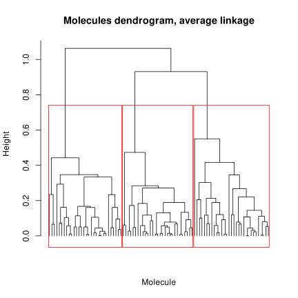
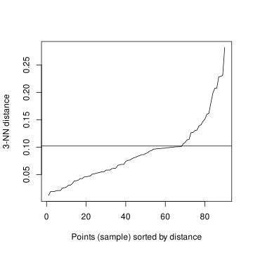

# Problem 2: Similarities between soil pollutant molecules
## Question a)

We can use hierarchical agglomerative clustering, k-medoids, DBSCAN.
We can't use k-means because we have a distance matrix and not a dataset,
so we can't compute means. We can use however k-medoids, which is a
k-means with the restriction that the centroids must be one of the points
in the dataset (in this case, these are called medoids).

The same goes for ward linkage method: we can't use it because we have a
distance matrix and not a dataset, so we can't compute the

$$ESS_j = \sum_{x \in C_j}{d(x, c_j)}^2$$
with $c_j = \text{ mean of } C_j$.

## Question b)
```R
> molecules.hclust <- hclust(molecules.dist, method = "average")
```



From the dendrogram we can see that the best number of clusters is 3.

```R
> k <- 3
> cluster.average <- cutree(molecules.hclust, k = k)
> table(cluster.average)
 1  2  3 
31 30 29
```

## Question c)
With ```minPts = 3``` the best value of epsilon is given by the elbow of the 3 nearest neighbors plot, which is obtained at ```eps = 0.1```.



```R
> minPts <- 3
> eps <- 0.105
> dbs1 <- dbscan(molecules.dist, eps = eps, minPts = minPts)
> dbs1
DBSCAN clustering for 90 objects.
Parameters: eps = 0.105, minPts = 3
Using unknown distances and borderpoints = TRUE
The clustering contains 2 cluster(s) and 6 noise points.

 0  1  2 
 6 56 28 

Available fields: cluster, eps, minPts, dist, borderPoints
```

We obtained 2 clusters and 6 noise points. Since we have only 90 points, this result is not very good and we should try again the DBSCAN algorithm with different parameters.

Also by computing the silhouette scores for both approaches we see that the hierarchical clustering approach is better than the DBSCAN one.

```R
> sil.average <- silhouette(cluster.average, dist = molecules.dist.matrix)
> summary(sil.average)
Silhouette of 90 units in 3 clusters from silhouette.default(x = cluster.average, dist = molecules.dist.matrix) :
 Cluster sizes and average silhouette widths:
       31        30        29 
0.6188589 0.6629969 0.6968598
```
```R
> sil1.dbscan <- silhouette(labels, dist = molecules.clustered)
> summary(sil1.dbscan)
Silhouette of 84 units in 2 clusters from silhouette.default(x = labels, dist = molecules.clustered) :
 Cluster sizes and average silhouette widths:
       56        28 
0.4144220 0.7263043
```

We can see for the first cluster that the silhouette score is ~ 0.4, while the scores for the average linkage hierarchical clustering are all grater than 0.5: we can try to improve the clustering by changing the parameters.

## Question d)
```R
> minPts <- 10
> eps <- 0.15
> dbs2 <- dbscan(molecules.dist, eps = eps, minPts = minPts)
> dbs2
DBSCAN clustering for 90 objects.
Parameters: eps = 0.15, minPts = 10
Using unknown distances and borderpoints = TRUE
The clustering contains 3 cluster(s) and 9 noise points.

 0  1  2  3 
 9 23 22 36 

Available fields: cluster, eps, minPts, dist, borderPoints
```

With ```minPts = 10``` and ```eps = 0.15``` we obtained three clusters with 23, 22 and 36 points respectively and 9 noise points.

Let's compute the silhouette score for this clustering.

```R
> sil2.dbscan <- silhouette(labels, dist = molecules.clustered)
> summary(sil2.dbscan)
Silhouette of 81 units in 3 clusters from silhouette.default(x = labels, dist = molecules.clustered) :
 Cluster sizes and average silhouette widths:
       23        22        36 
0.7564685 0.6471209 0.3853053 
```

We can see we have a nice silhouette score also for this clustering, but I would say that globally the best clustering is the one obtained with the average linkage hierarchical clustering, because of the average value of the silhouette scores.

We also have 9 noise points in the dbscan version, that the algorithm couldn't assign to any cluster.

## Question e)
### Multidimensional Scaling ???