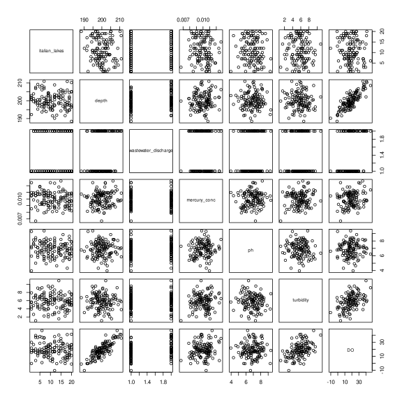
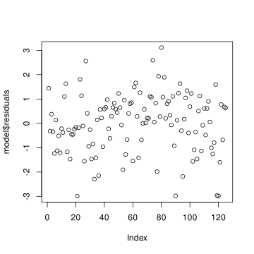
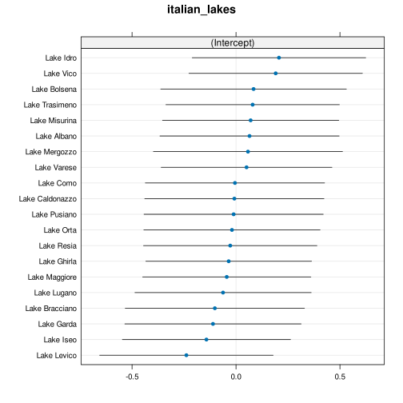

# Problem 3: Dissolved oxygen in Italian lakes
## Question a)
By producing a pair plot between all variables in the dataset, we can already see a strong positive correlation between DO and depth. There is also a small positive correlation between DO and turbidity.



### Fit the model
but first introduce a dummy variable for the categorical variable ```wastewater_discharge```.

```R
> dummy.ww <- ifelse(lakes$wastewater_discharge == "Yes", 1, 0)
> model <- lm(DO ~ depth + mercury_conc + ph + turbidity + dummy.ww, data = lakes)
> summary(model)
Call:
lm(formula = DO ~ depth + mercury_conc + ph + turbidity + dummy.ww, 
    data = lakes)
Coefficients:
               Estimate Std. Error t value Pr(>|t|)    
(Intercept)  -402.33318    5.11249 -78.696  < 2e-16 ***
depth           1.98190    0.02525  78.491  < 2e-16 ***
mercury_conc   68.62313  103.04971   0.666    0.507    
ph              0.86387    0.11176   7.729 3.82e-12 ***
turbidity       2.99560    0.06113  49.007  < 2e-16 ***
dummy.ww        1.91574    0.22875   8.375 1.26e-13 ***
---
Signif. codes:  0 ‘***’ 0.001 ‘**’ 0.01 ‘*’ 0.05 ‘.’ 0.1 ‘ ’ 1

Residual standard error: 1.22 on 119 degrees of freedom
Multiple R-squared:  0.9869,    Adjusted R-squared:  0.9864 
F-statistic:  1795 on 5 and 119 DF,  p-value: < 2.2e-16
```

From this tests I can see that the mercury_conc variable is not significant, so I will remove it from the model.

```R
> summary(model)
Call:
lm(formula = DO ~ depth + ph + turbidity + dummy.ww, data = lakes)
Coefficients:
              Estimate Std. Error t value Pr(>|t|)    
(Intercept) -402.20573    5.09705 -78.910  < 2e-16 ***
depth          1.98432    0.02493  79.600  < 2e-16 ***
ph             0.87156    0.11091   7.858 1.87e-12 ***
turbidity      3.00054    0.06053  49.569  < 2e-16 ***
dummy.ww       1.89707    0.22650   8.376 1.19e-13 ***
---
Signif. codes:  0 ‘***’ 0.001 ‘**’ 0.01 ‘*’ 0.05 ‘.’ 0.1 ‘ ’ 1

Residual standard error: 1.218 on 120 degrees of freedom
Multiple R-squared:  0.9869,    Adjusted R-squared:  0.9864 
F-statistic:  2254 on 4 and 120 DF,  p-value: < 2.2e-16
```

Now all variables are significant.

The estimates for the model unknown are:
```R
> model$coefficients
 (Intercept)        depth           ph    turbidity     dummy.ww 
-402.2057272    1.9843187    0.8715624    3.0005436    1.8970702
> beta0 <- -402.2057272
> beta1 <- 1.9843187
> beta3 <- 0.8715624
> beta4 <- 3.0005436
> beta5 <- 1.8970702
```

As we can see the R^2 value is 0.9869 (adjusted R^2 is 0.9864), which means that the model explains 98.69% of the variance in the datam, and hence the percentage of unexplained variability is 1.31%.

To verify if we can assume the homoschedasticity of the residuals, we can look at the scatter plot of the residuals and see if there is an evident change in the variance of these.



We can see that the residuals seems Gaussian.
Residuals doesn't seem to have a change in the variance, but we can also perform a Breusch-Pagan test to verify this.


```R
> shapiro.test(model$residuals)

        Shapiro-Wilk normality test

data:  model$residuals
W = 0.98517, p-value = 0.1905
```
```R
> ncvTest(model$residuals, lakes$italian_lakes)
Non-constant Variance Score Test 
Variance formula: ~ fitted.values 
Chisquare = 0.1496764, Df = 1, p = 0.69884
```

P-value is 0.1905 for the Shapiro-Wilk test, which is greater than any significant level, so we can assume the normality of the residuals.

The p-value is 0.69884 for the Breush-Pagan test, which is greater than any significant level, so we can assume the homoschedasticity of the residuals.

## Question b)
Average increase of DO due to increment of 3 NTU in turbidity:
```R
> 3 * beta4 # 3 * 3.0005436
9.001631
> linearHypothesis(model, c(0, 0, 0, 1, 0), 0)
Linear hypothesis test

Hypothesis:
turbidity = 0

Model 1: restricted model
Model 2: DO ~ depth + ph + turbidity + dummy.ww

  Res.Df    RSS Df Sum of Sq      F    Pr(>F)    
1    121 3820.2                                  
2    120  177.9  1    3642.3 2457.1 < 2.2e-16 ***
```

It is significant, since the turbidity is significant in the model.

Mean difference of DO between lakes with and without wastewater discharge:
```R
> mean(lakes$DO[lakes$wastewater_discharge == "Yes"]) -
    mean(lakes$DO[lakes$wastewater_discharge == "No"])
6.019243
```

## Question c)
```R
> formula <- DO ~ depth + ph + turbidity + dummy.ww
> gen.model <- gls(formula, data = lakes, correlation = corCompSymm(form = ~ 1 | italian_lakes))
> summary(gen.model)
Generalized least squares fit by REML
  Model: formula 
  Data: lakes 
       AIC      BIC    logLik
  428.1729 447.6854 -207.0865

Correlation Structure: Compound symmetry
 Formula: ~1 | italian_lakes 
 Parameter estimate(s):
       Rho 
0.03924728 

Coefficients:
                Value Std.Error   t-value p-value
(Intercept) -402.5209  5.082554 -79.19658       0
depth          1.9858  0.024820  80.00590       0
ph             0.8739  0.109935   7.94955       0
turbidity      3.0059  0.060256  49.88479       0
dummy.ww       1.8637  0.225914   8.24949       0

 Correlation: 
          (Intr) depth  ph     trbdty
depth     -0.985                     
ph        -0.203  0.050              
turbidity -0.156  0.073  0.119       
dummy.ww   0.212 -0.210 -0.152 -0.067

Residual standard error: 1.218486 
Degrees of freedom: 125 total; 120 residual
```

The estimates for rho and sigma are:
```R
rho <- 0.03924728
sigma <- 1.218486
```

95% confidence interval for both:
```R
> intervals(gen.model, which = "var-cov")
Approximate 95% confidence intervals

 Correlation structure:
          lower       est.     upper
Rho -0.04937959 0.03924728 0.2155105

 Residual standard error:
   lower     est.    upper 
1.072836 1.218486 1.383910 
```

We can see that the rho value is very close to 0, and is inside the confidence interval, so we can assume that the correlation between the observations is 0.

## Question d)
```R
> mix.eff.model <- lmer(DO ~ depth + ph + turbidity + dummy.ww + (1 |italian_lakes), data = lakes)
> sigma.eps <- get_variance_residual(mix.eff.model)
> sigma.b <- get_variance_random(mix.eff.model)
> PVRE <- sigma.b / (sigma.b + sigma.eps)
> PVRE
0.03924727
```

## Question e)
```R
dotplot(ranef(mix.eff.model, condVar = TRUE))
```



The lake associated with the lowest concentration of DO is lake Levico, and the lake associated with the highest concentration of DO is lake Idro.