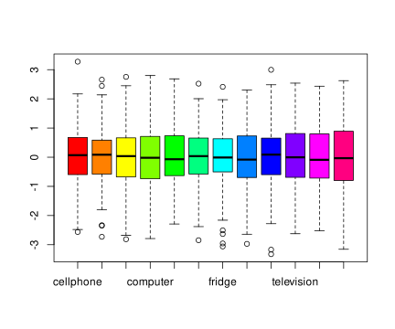
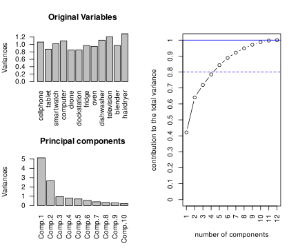
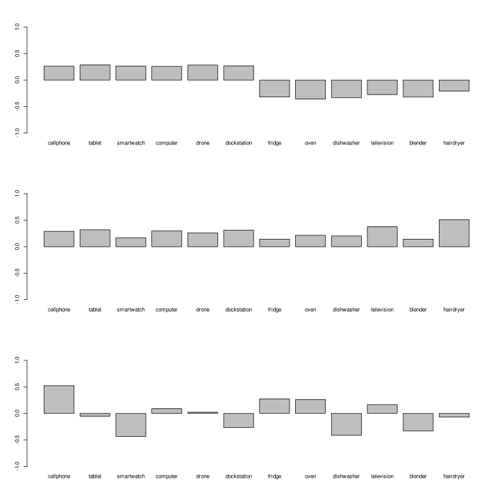
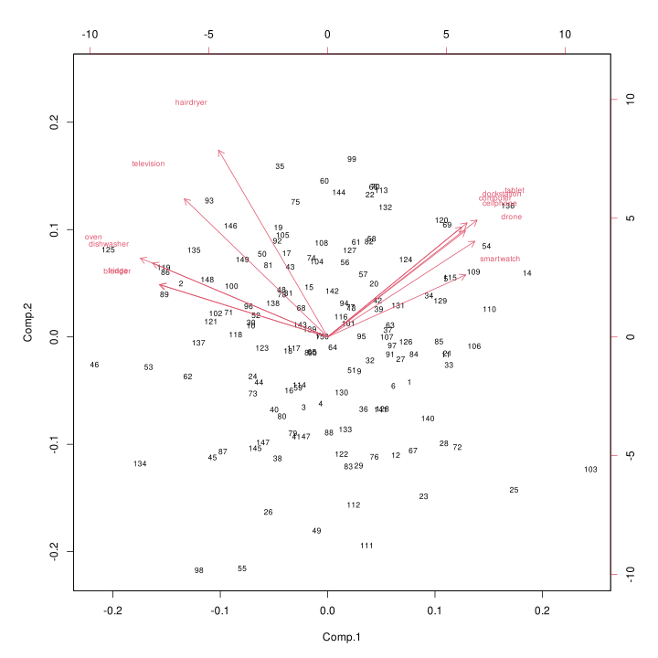

# E1
## Question a)
As we can see from the boxplot below, there is no significant change in variability between all the variables in the group by only scaling, so there is no need in scaling the data.

By looking at the scree plot we can see that the first 2 principal components are the one with most of the variability, but they alone are not enough to explain the 80% of the whole variability of the dataset: to do so we would need to consider the first four.

## Question b)

From the first principal components we can see a clear contrast between the first 6 products and the second 6. 

In fact we can assimilate all the first 6 products to belong to the same group, i.e. portable devices/nerd devices, and the same for the second 6, i.e. home devices, like ovens, fridges and televisions.

## Question c)

We can assimiliate the product labeled as 134 as an home device (since the value of the first principal component is below zero), and a product that doesn't sell that much, or the opposite, since the value of the second principal component is below zero, and it represents a flow of sales, that could be both high or low (I presume high)

## Question d)
