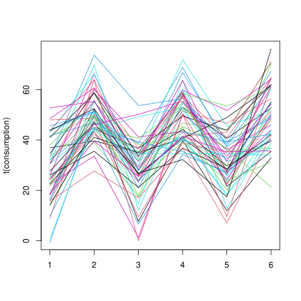

# E2
## Question a)
Just by looking at the means of the three columns, we can see that there may be a pattern in the energy consumption, since the means for the two groups am/pm seems to differ at each working day:
```R
> colMeans(consumptions)
 am_day1  pm_day1  am_day2  pm_day2  am_day3  pm_day3 
27.95760 50.31259 27.87424 49.38598 31.03480 50.90201
```

We can perform test for repeated measures to see if there is a difference between the two groups.

First we check data multivariate normality    
```R
> mvn(consumptions)$multivariateNormality$`p value`
0.4053346
```

The p-value is greater that any significant level, so we reject the null hypothesis that the data is not multivariate normal.

Here is the matplot of the observations at each time of the day:


## Question b)
I build the following contrast matrix to test the data:
```R
     [,1] [,2] [,3] [,4] [,5] [,6]
[1,]   -1    1    0    0    0    0
[2,]    0    0   -1    1    0    0
[3,]    0    0    0    0   -1    1
```

I can now use the test statistic:
$$Test: H0: C \mu == c(0, 0, 0) \text{ vs } H1: C \mu \neq c(0, 0, 0)$$

I use the Hotelling T2 statistic to do so, by computing the Fisher quantile and comparing it to the test statistic:
```R
> T2 <- n * t(Md - delta.0) %*% solve(Sd) %*% (Md - delta.0)
> qF <- ((p - 1) * (n - 1) / (n - (p - 1))) * qf(1 - alpha, p - 1, n - p + 1)
> T2 < qF
FALSE
```

Since the output is false, we reject the H0 hypothesis that the two groups are equal at 5%.

The p-value is:
```R
> P <- 1 - pf(T2 * (n - (p - 1)) / ((p - 1) * (n - 1)), p - 1, n - p + 1)
> P
0
```

The p-value obtained is very very small, hence we can reject the null hypothesis that the two groups are equal at any significant level.
## Question c)
