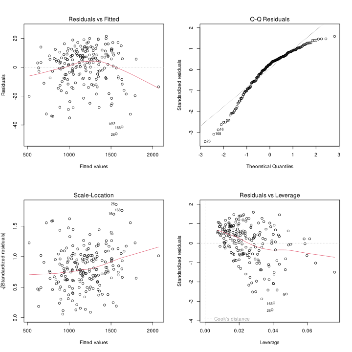
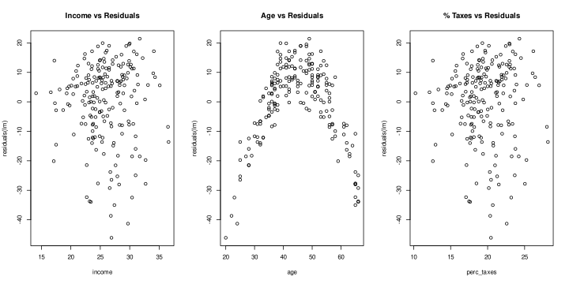
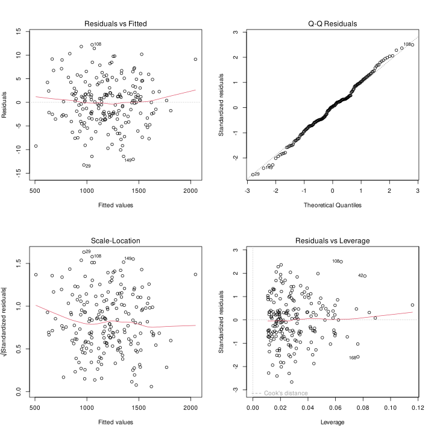

# E3
## Question a)
Fitting the model as requested: 
```R
> lm <- lm(avg_exp ~ income + age + perc_taxes + owns_house)
> summary(lm)
Coefficients:
             Estimate Std. Error  t value Pr(>|t|)    
(Intercept) 207.12204   15.96474   12.974  < 2e-16 ***
income       79.97058    9.83449    8.132 4.83e-14 ***
age         -12.08139    0.09064 -133.283  < 2e-16 ***
perc_taxes  -27.11908   12.28530   -2.207   0.0284 *  
owns_house  -47.63140    2.14467  -22.209  < 2e-16 ***
---
Signif. codes:  0 ‘***’ 0.001 ‘**’ 0.01 ‘*’ 0.05 ‘.’ 0.1 ‘ ’ 1

Residual standard error: 13.69 on 195 degrees of freedom
Multiple R-squared:  0.9974,    Adjusted R-squared:  0.9973 
F-statistic: 1.841e+04 on 4 and 195 DF,  p-value: < 2.2e-16
```

As we can read from the summary we have an overall p-value that is very small, so indeed we should be able to reject the null hypothesis that the model is not significant, and we should be able to predict the value of the average expenditure with the given variables.

Also the R-squared is very close to 1, so the model is very good at predicting the value of the average expenditure, but we have to be careful because we may be overfitting the data.

We can also read that the percentage of the salary spent on taxes is significant at 5%, but not at 1%: we should still keep it in the model though.

The estimates for the unknown parameters are:
```R
beta0   207.12204
beta1    79.97058
beta2   -12.08139
beta3   -27.11908
beta4   -47.63140
```

And the estimate of the variance is:
```R
> sum(residuals(lm)^2)/lm$df
187.286
```

## Question b)

I can now analyze the residuals of the model:



And as we can see, in particular from the QQ-plot, the residuals are not normally distributed.

We can also check this by performing a Shapiro-Wilk test:
```R
> shapiro.test(residuals(lm))

        Shapiro-Wilk normality test

data:  residuals(lm)
W = 0.92665, p-value = 1.845e-08
```

And indeed the p-value is very very small (we reject the normality at any significant level)



By the plots of the variables vs the residuals, we can see a clear quadratic dependence of the residuals with respect to the age: let's add this term to the model.

```R
> lm.2 <- lm(avg_exp ~ income + age + age2 + perc_taxes + owns_house)
> summary(lm.2)
Coefficients:
              Estimate Std. Error t value Pr(>|t|)    
(Intercept)  33.343450   7.694592   4.333 2.36e-05 ***
income       57.906393   3.685998  15.710  < 2e-16 ***
age          -3.147939   0.256342 -12.280  < 2e-16 ***
age2         -0.098704   0.002808 -35.151  < 2e-16 ***
perc_taxes    1.192207   4.608244   0.259    0.796    
owns_house  -48.988116   0.793030 -61.773  < 2e-16 ***
---
Signif. codes:  0 ‘***’ 0.001 ‘**’ 0.01 ‘*’ 0.05 ‘.’ 0.1 ‘ ’ 1

Residual standard error: 5.054 on 194 degrees of freedom
Multiple R-squared:  0.9996,    Adjusted R-squared:  0.9996 
F-statistic: 1.082e+05 on 5 and 194 DF,  p-value: < 2.2e-16
```

These are the estimates of the parameters (estimate column), let's plot the residuals again:


Know we obtained normality of the residuals.

We could even remove the percentage of taxes from the model, since it is not significant at any significant level anymore.

```R
> lm.3 <- lm(avg_exp ~ income + age + age2 + owns_house)
> summary(lm.3)
Coefficients:
              Estimate Std. Error t value Pr(>|t|)    
(Intercept)  32.249480   6.413156   5.029 1.12e-06 ***
income       58.859702   0.092619 635.503  < 2e-16 ***
age          -3.159275   0.251964 -12.539  < 2e-16 ***
age2         -0.098577   0.002758 -35.740  < 2e-16 ***
owns_house  -48.964881   0.786041 -62.293  < 2e-16 ***
---
Signif. codes:  0 ‘***’ 0.001 ‘**’ 0.01 ‘*’ 0.05 ‘.’ 0.1 ‘ ’ 1

Residual standard error: 5.042 on 195 degrees of freedom
Multiple R-squared:  0.9996,    Adjusted R-squared:  0.9996 
F-statistic: 1.359e+05 on 4 and 195 DF,  p-value: < 2.2e-16
```

Now all variables are significant.
## Question c)

## Question d)

## Question e)
Fit the model with lasso:
```R
lambda <- 10^seq(10, -2, length.out = 100)

x <- model.matrix(avg_exp ~ income + age + perc_taxes + owns_house, data = expenses)[, -1]
y <- avg_exp

fit.lasso <- glmnet(x, y, lambda = lambda)
summary(fit.lasso)
```
